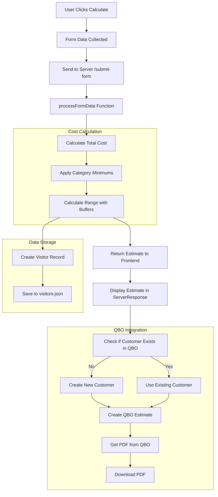

```mermaid
flowchart TD
    A[User Clicks Calculate] --> B[Form Data Collected]
    B --> C[Send to Server /submit-form]
    
    C --> D[processFormData Function]
    
    D --> E[Calculate Total Cost]
    E --> F[Apply Category Minimums]
    F --> G[Calculate Range with Buffers]
    
    G --> H[Create Visitor Record]
    H --> I[Save to visitors.json]
    
    G --> J[Return Estimate to Frontend]
    
    J --> K[Display Estimate in ServerResponse]
    K --> L[Check if Customer Exists in QBO]
    
    L -->|No| M[Create New Customer]
    L -->|Yes| N[Use Existing Customer]
    
    M --> O[Create QBO Estimate]
    N --> O
    
    O --> P[Get PDF from QBO]
    P --> Q[Download PDF]
    
    subgraph "Cost Calculation"
        E
        F
        G
    end
    
    subgraph "Data Storage"
        H
        I
    end
    
    subgraph "QBO Integration"
        L
        M
        N
        O
        P
        Q
    end
```