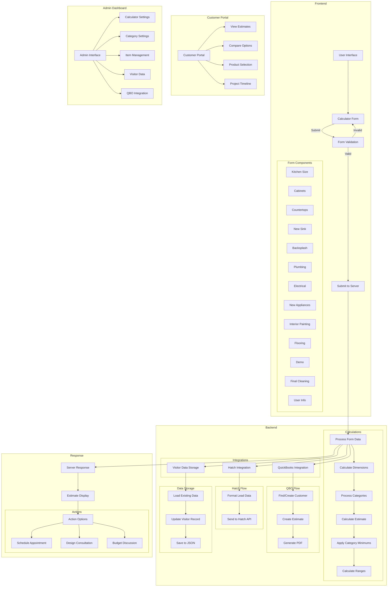
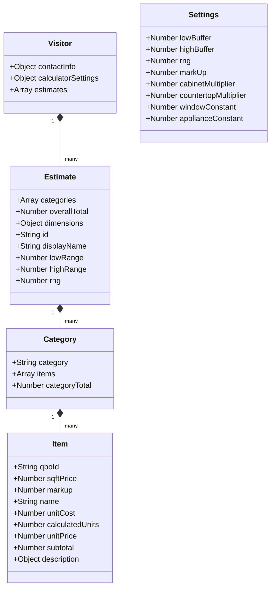

```mermaid
graph TB
    subgraph Frontend
        A[User Interface] --> B[Calculator Form]
        B --> |Submit| C[Form Validation]
        
        subgraph Form Components
            D[Kitchen Size]
            E[Cabinets]
            F[Countertops]
            G[New Sink]
            H[Backsplash]
            I[Plumbing]
            J[Electrical]
            K[New Appliances]
            L[Interior Painting]
            M[Flooring]
            N[Demo]
            O[Final Cleaning]
            P[User Info]
        end
        
        C --> |Valid| Q[Submit to Server]
        C --> |Invalid| B
    end

    subgraph Backend
        Q --> R[Process Form Data]
        
        subgraph Calculations
            R --> S[Calculate Dimensions]
            S --> T[Process Categories]
            T --> U[Calculate Estimate]
            U --> V[Apply Category Minimums]
            V --> W[Calculate Ranges]
        end
        
        subgraph Integrations
            R --> X[QuickBooks Integration]
            R --> Y[Hatch Integration]
            R --> Z[Visitor Data Storage]
        end
        
        subgraph QBO Flow
            X --> QA[Find/Create Customer]
            QA --> QB[Create Estimate]
            QB --> QC[Generate PDF]
        end
        
        subgraph Hatch Flow
            Y --> HA[Format Lead Data]
            HA --> HB[Send to Hatch API]
        end
        
        subgraph Data Storage
            Z --> DA[Load Existing Data]
            DA --> DB[Update Visitor Record]
            DB --> DC[Save to JSON]
        end
    end

    subgraph Response
        R --> RA[Server Response]
        RA --> RB[Estimate Display]
        RB --> RC[Action Options]
        
        subgraph Actions
            RC --> AA[Schedule Appointment]
            RC --> AB[Design Consultation]
            RC --> AC[Budget Discussion]
        end
    end

    subgraph Customer Portal
        CP[Customer Portal]
        CP --> CP1[View Estimates]
        CP --> CP2[Compare Options]
        CP --> CP3[Product Selection]
        CP --> CP4[Project Timeline]
    end

    subgraph Admin Dashboard
        AD[Admin Interface]
        AD --> AD1[Calculator Settings]
        AD --> AD2[Category Settings]
        AD --> AD3[Item Management]
        AD --> AD4[Visitor Data]
        AD --> AD5[QBO Integration]
    end
```

```mermaid
classDiagram
    class Estimate {
        +Array categories
        +Number overallTotal
        +Object dimensions
        +String id
        +String displayName
        +Number lowRange
        +Number highRange
        +Number rng
    }
    
    class Category {
        +String category
        +Array items
        +Number categoryTotal
    }
    
    class Item {
        +String qboId
        +Number sqftPrice
        +Number markup
        +String name
        +Number unitCost
        +Number calculatedUnits
        +Number unitPrice
        +Number subtotal
        +Object description
    }
    
    class Visitor {
        +Object contactInfo
        +Object calculatorSettings
        +Array estimates
    }
    
    class Settings {
        +Number lowBuffer
        +Number highBuffer
        +Number rng
        +Number markUp
        +Number cabinetMultiplier
        +Number countertopMultiplier
        +Number windowConstant
        +Number applianceConstant
    }

    Estimate "1" *-- "many" Category
    Category "1" *-- "many" Item
    Visitor "1" *-- "many" Estimate
```