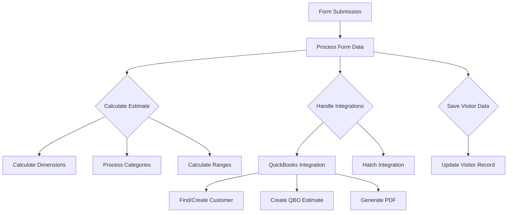
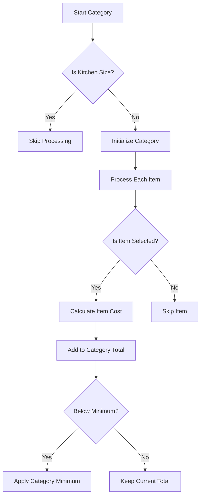
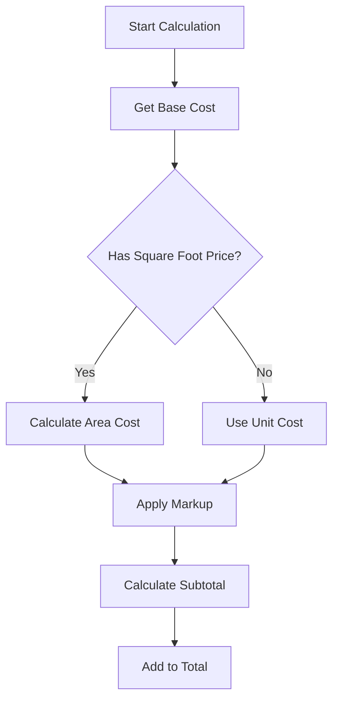
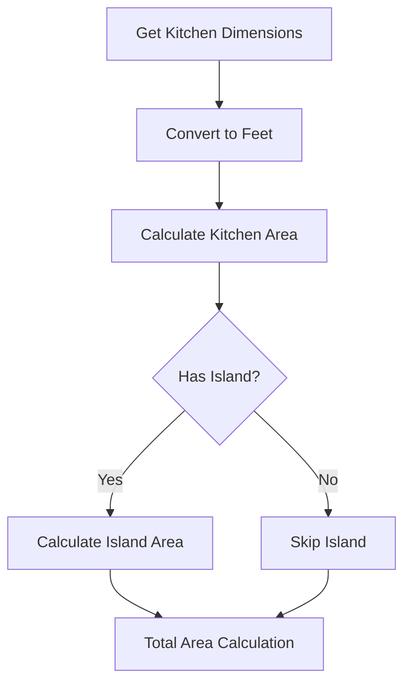
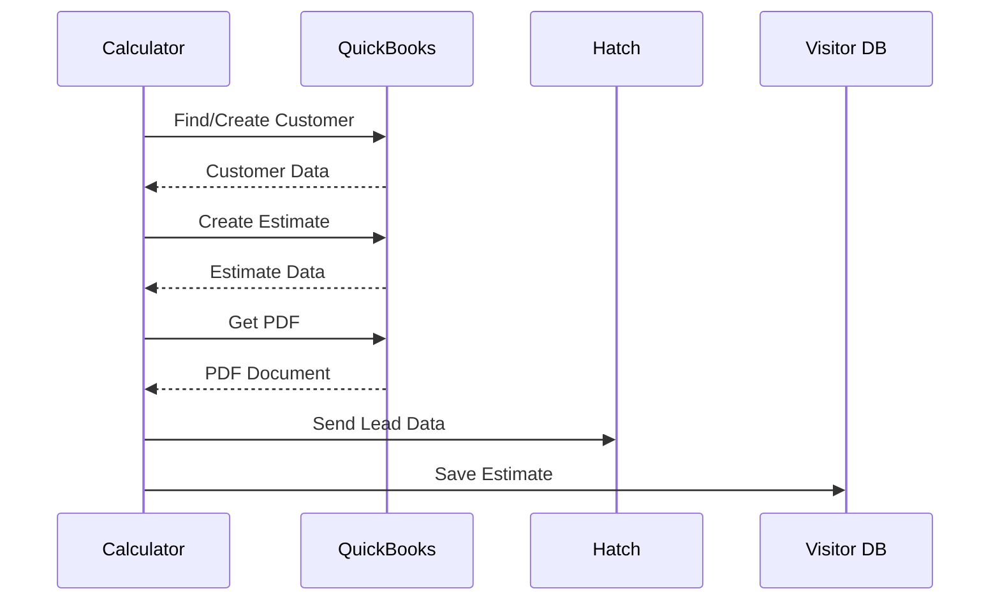
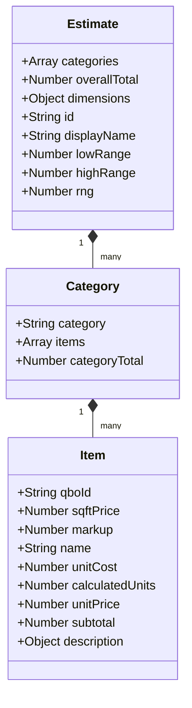

# Kitchen Calculator Form Handler Documentation

This document provides a visual representation of how the form handler processes kitchen remodel estimates.

## Main Process Flow



## Category Processing Flow



## Cost Calculation Process



## Dimensions Calculation



## Integration Flow



## Data Structure



## Key Calculations

### Price Calculation Formula
```
Unit Price = Base Cost × (1 + Markup)
```

### Area-Based Price Formula
```
Total = Square Foot Price × Area × (1 + Markup)
```

### Range Calculation
```
Low Range = Total - (Total × (Low Buffer + RNG))
High Range = Total + (Total × (High Buffer + RNG))
```

## Important Notes

1. All measurements are converted from inches to feet
2. Category minimums are enforced when applicable
3. Special handling for:
   - Backsplash calculations
   - Cabinet measurements
   - Waterfall edges
   - Fixture counts

## Integration Points

1. **QuickBooks Online**
   - Customer management
   - Estimate creation
   - PDF generation

2. **Hatch**
   - Lead data transmission
   - Customer information sync

3. **Visitor Database**
   - Estimate history
   - Customer information
   - Calculator settings