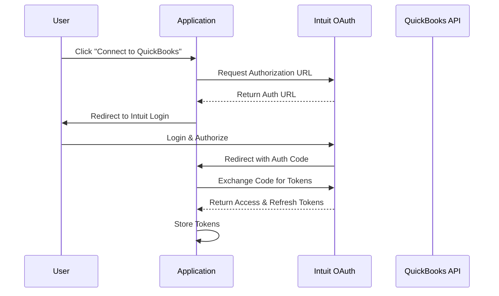
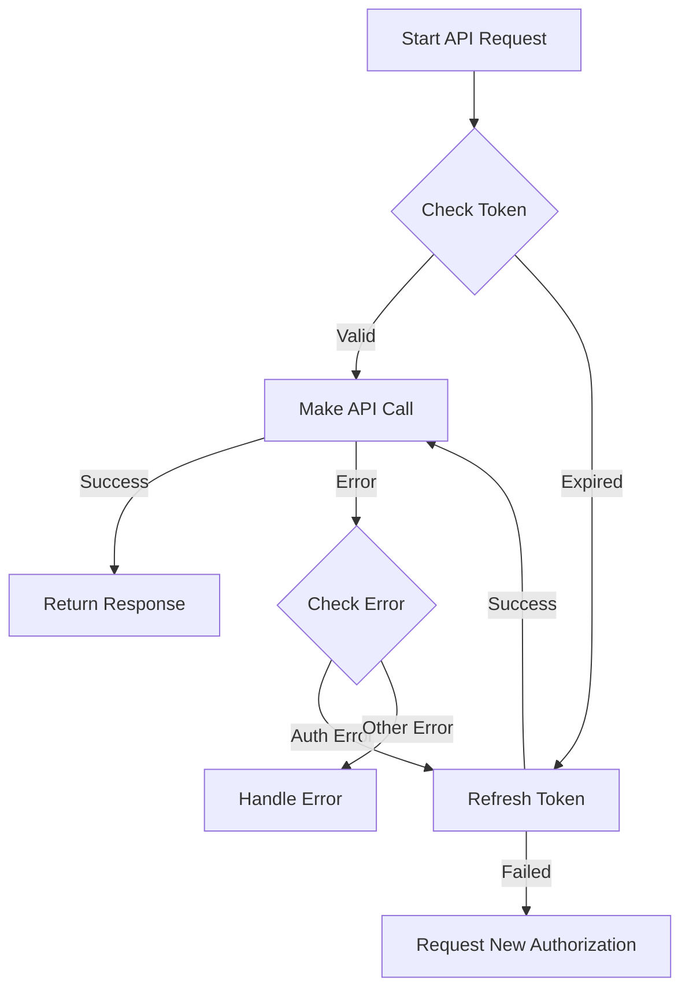
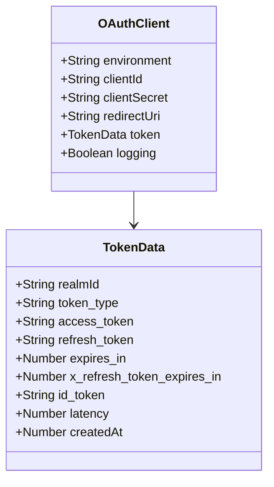
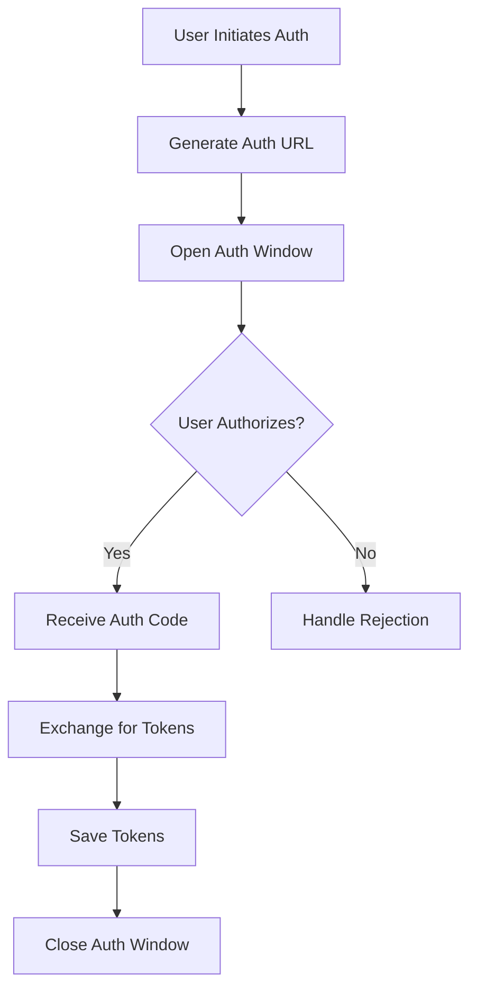
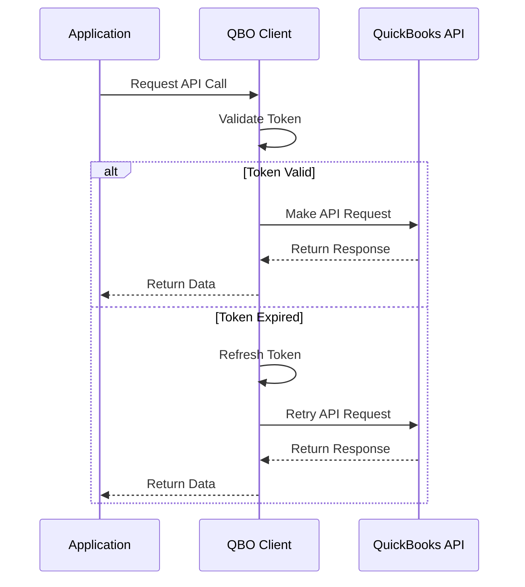
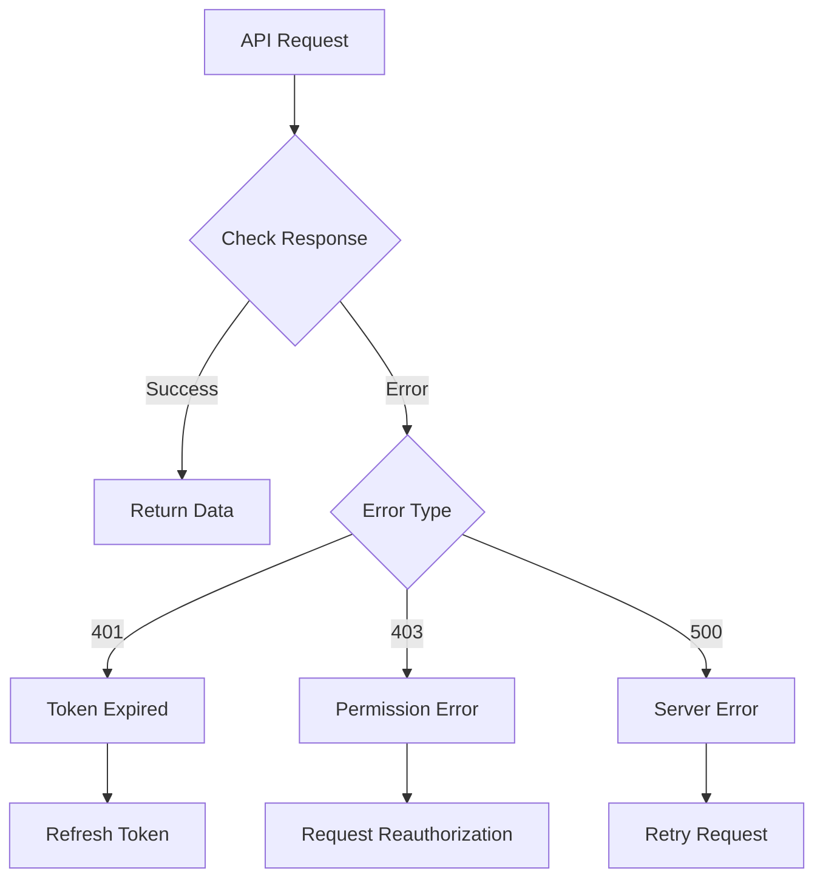

# QuickBooks Online OAuth Integration Documentation

This document provides a visual representation of the QuickBooks Online (QBO) OAuth authentication and integration process.

## OAuth Flow Overview



## Token Management Flow



## Token Storage Structure



## Authorization Process



## API Integration Flow



## Error Handling Flow



## Key Components

### 1. OAuth Client Configuration
```javascript
{
  clientId: "YOUR_CLIENT_ID",
  clientSecret: "YOUR_CLIENT_SECRET",
  environment: "sandbox|production",
  redirectUri: "YOUR_REDIRECT_URI",
  logging: true
}
```

### 2. Token Structure
```javascript
{
  realmId: "COMPANY_ID",
  token_type: "bearer",
  access_token: "ACCESS_TOKEN",
  refresh_token: "REFRESH_TOKEN",
  expires_in: 3600,
  x_refresh_token_expires_in: 8726400,
  createdAt: TIMESTAMP
}
```

## Important Notes

1. **Token Security**
   - Tokens are stored securely in token.json
   - Access tokens expire after 1 hour
   - Refresh tokens expire after 100 days
   - Never expose tokens in client-side code

2. **Environment Considerations**
   - Sandbox environment for development/testing
   - Production environment for live data
   - Different credentials for each environment

3. **Authorization Scopes**
   - com.intuit.quickbooks.accounting
   - com.intuit.quickbooks.payment
   - OpenId scopes for user information

4. **Best Practices**
   - Always check token validity before API calls
   - Implement proper error handling
   - Store company ID (realmId) with tokens
   - Maintain token refresh mechanism
   - Log authentication events

## Integration Points

1. **Initial Authorization**
   - User clicks "Connect to QuickBooks"
   - Redirect to Intuit login
   - Handle authorization callback
   - Store initial tokens

2. **Token Management**
   - Automatic token refresh
   - Token validation
   - Token storage
   - Error handling

3. **API Integration**
   - Company information
   - Customer management
   - Estimate creation
   - PDF generation