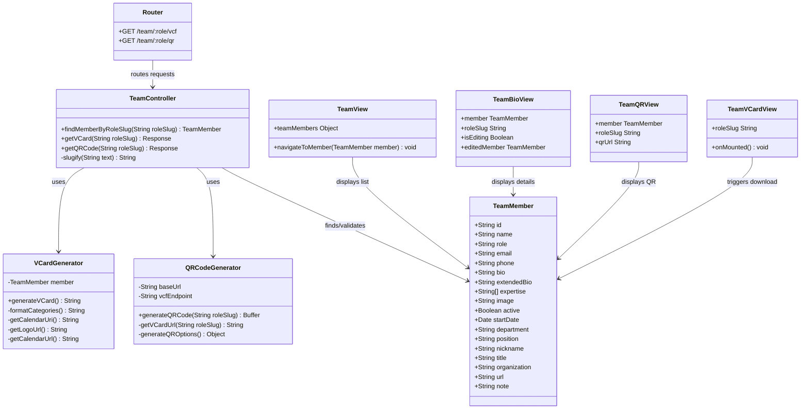
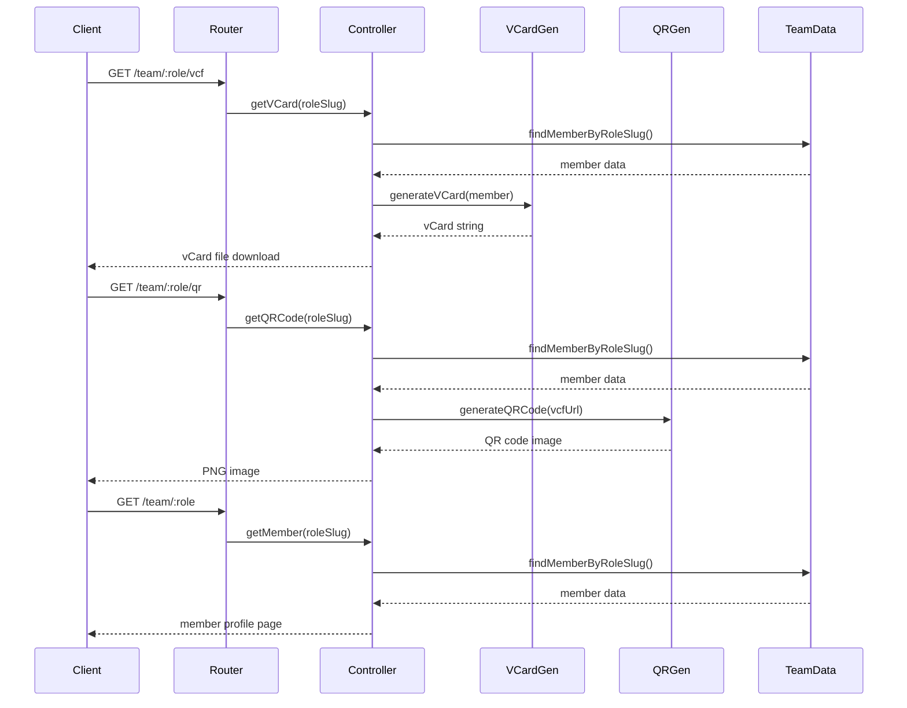
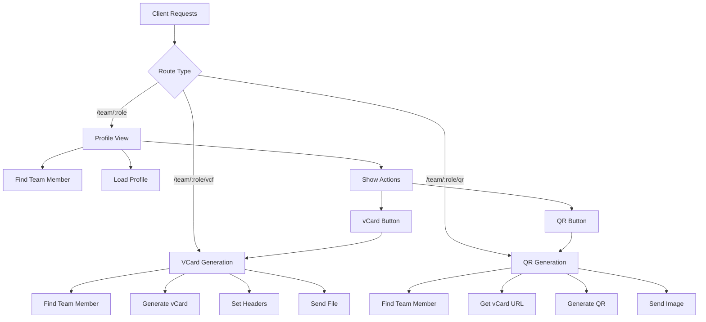
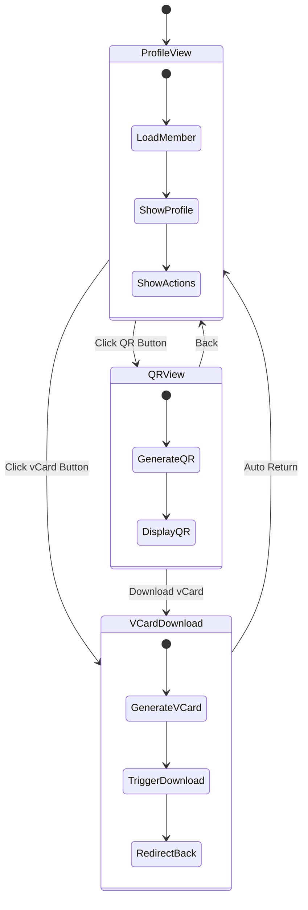

```mermaid
classDiagram
    class TeamMember {
        +String id
        +String name
        +String role
        +String email
        +String phone
        +String bio
        +String extendedBio
        +String[] expertise
        +String image
        +Boolean active
        +Date startDate
        +String department
        +String position
        +String nickname
        +String title
        +String organization
        +String url
        +String note
    }

    class VCardGenerator {
        -TeamMember member
        +generateVCard() String
        -formatCategories() String
        -getCalendarUri() String
        -getLogoUrl() String
        -getCalendarUrl() String
    }

    class QRCodeGenerator {
        -String baseUrl
        -String vcfEndpoint
        +generateQRCode(String roleSlug) Buffer
        -getVCardUrl(String roleSlug) String
        -generateQROptions() Object
    }

    class TeamController {
        +findMemberByRoleSlug(String roleSlug) TeamMember
        +getVCard(String roleSlug) Response
        +getQRCode(String roleSlug) Response
        -slugify(String text) String
    }

    class Router {
        +GET /team/:role/vcf
        +GET /team/:role/qr
    }

    class TeamView {
        +teamMembers Object
        +navigateToMember(TeamMember member) void
    }

    class TeamBioView {
        +member TeamMember
        +roleSlug String
        +isEditing Boolean
        +editedMember TeamMember
    }

    class TeamQRView {
        +member TeamMember
        +roleSlug String
        +qrUrl String
    }

    class TeamVCardView {
        +roleSlug String
        +onMounted() void
    }

    Router --> TeamController : routes requests
    TeamController --> VCardGenerator : uses
    TeamController --> QRCodeGenerator : uses
    TeamController --> TeamMember : finds/validates
    TeamView --> TeamMember : displays list
    TeamBioView --> TeamMember : displays details
    TeamQRView --> TeamMember : displays QR
    TeamVCardView --> TeamMember : triggers download

```

```mermaid
sequenceDiagram
    participant Client
    participant Router
    participant Controller
    participant VCardGen
    participant QRGen
    participant TeamData

    %% VCard Flow
    Client->>Router: GET /team/:role/vcf
    Router->>Controller: getVCard(roleSlug)
    Controller->>TeamData: findMemberByRoleSlug()
    TeamData-->>Controller: member data
    Controller->>VCardGen: generateVCard(member)
    VCardGen-->>Controller: vCard string
    Controller-->>Client: vCard file download

    %% QR Code Flow
    Client->>Router: GET /team/:role/qr
    Router->>Controller: getQRCode(roleSlug)
    Controller->>TeamData: findMemberByRoleSlug()
    TeamData-->>Controller: member data
    Controller->>QRGen: generateQRCode(vcfUrl)
    QRGen-->>Controller: QR code image
    Controller-->>Client: PNG image

    %% Frontend Navigation Flow
    Client->>Router: GET /team/:role
    Router->>Controller: getMember(roleSlug)
    Controller->>TeamData: findMemberByRoleSlug()
    TeamData-->>Controller: member data
    Controller-->>Client: member profile page
```

```mermaid
graph TD
    A[Client Requests] --> B{Route Type}
    
    B -->|/team/:role/vcf| C[VCard Generation]
    B -->|/team/:role/qr| D[QR Generation]
    B -->|/team/:role| E[Profile View]
    
    C --> F[Find Team Member]
    C --> G[Generate vCard]
    C --> H[Set Headers]
    C --> I[Send File]
    
    D --> J[Find Team Member]
    D --> K[Get vCard URL]
    D --> L[Generate QR]
    D --> M[Send Image]
    
    E --> N[Find Team Member]
    E --> O[Load Profile]
    E --> P[Show Actions]
    
    P --> Q[QR Button]
    P --> R[vCard Button]
    
    Q --> D
    R --> C
```

```mermaid
stateDiagram-v2
    [*] --> ProfileView
    
    ProfileView --> QRView: Click QR Button
    ProfileView --> VCardDownload: Click vCard Button
    
    QRView --> ProfileView: Back
    QRView --> VCardDownload: Download vCard
    
    VCardDownload --> ProfileView: Auto Return
    
    state ProfileView {
        [*] --> LoadMember
        LoadMember --> ShowProfile
        ShowProfile --> ShowActions
    }
    
    state QRView {
        [*] --> GenerateQR
        GenerateQR --> DisplayQR
    }
    
    state VCardDownload {
        [*] --> GenerateVCard
        GenerateVCard --> TriggerDownload
        TriggerDownload --> RedirectBack
    }
```